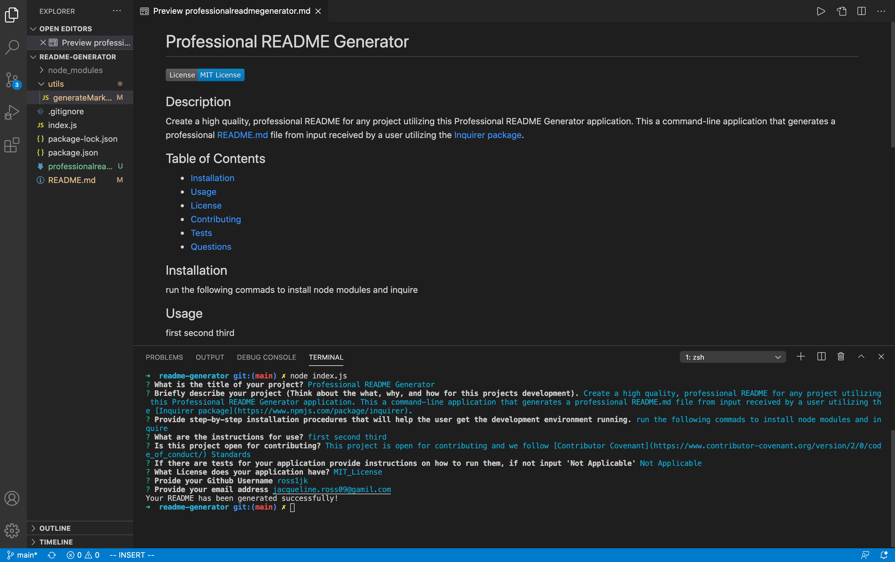

# Professional README Generator

  
## Description

Create a high quality, professional README for any project utilizing this Professional README Generator application. This a command-line application that generates a professional README.md file from input received by a user utilizing the [Inquirer package](https://www.npmjs.com/package/inquirer).
  
## Table of Contents

* [Installation](#Installation)
* [Usage](#Usage)
* [License](#License)
* [Contributing](#Contributing)
* [Tests](#Tests)
* [Questions](#Questions)
  
## Installation

First, ensure that that you have [node.js](https://nodejs.org/en/) installed. 
Once this is application is cloned down to your Visual Studio, you will first need to run the following commands to initialise your repository and install inquirer:

* npm init -y
* npm i inquirer --save

## Usage

Watch the following video for step by step instructions on how to use this application: [Utilizing the README Generator(https://drive.google.com/file/d/1z4gkgv9rKMIO66NJb5FfiYh5-YNlgVTo/view)

Once Installed, you will run the command node index.js in your terminal. From there you will be asked a series of prompts. Be as detailed as possible when answering. When completed, your Terminal will say ‘your README has generated successfully!’. You will then see your README markdown file will be added to your projects current files. Be sure to review your file, remember to save, commit, and push your file to your GitHub repository.

Readme Mock-Up Functionality:

See Samples in the repository folder: application samples

## License

This application has a MIT License type. Please read more about permissions at [Choose A License](https://choosealicense.com/licenses/)

## Contributing

This project is open for contributing and we follow [Contributor Covenant](https://www.contributor-covenant.org/version/2/0/code_of_conduct/) Standards
  
## Tests

Not Applicable
  
## Questions

Please reach out to me with any additional questions by contacting me.

* GitHub Profile: https://github.com/ross1jk
* My Email Address: Jacqueline.ross09@gmail.com